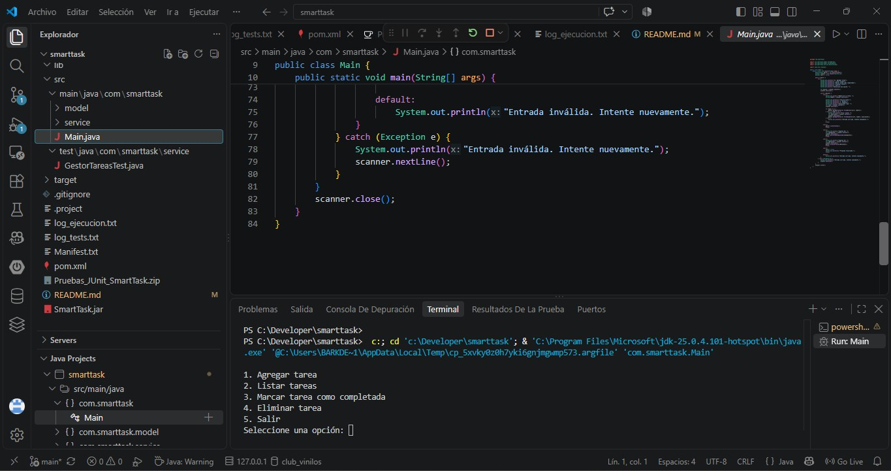
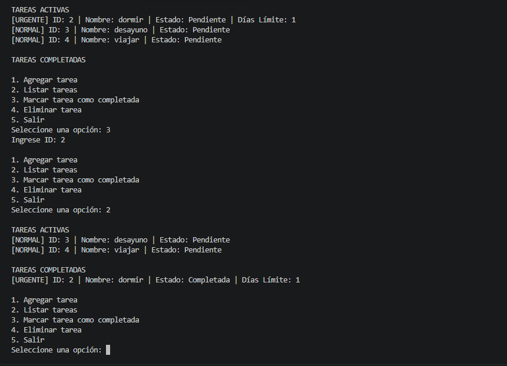
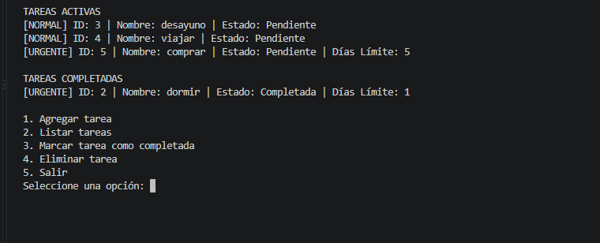
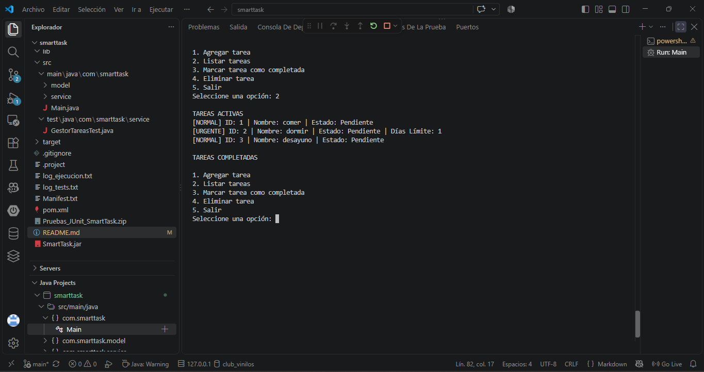
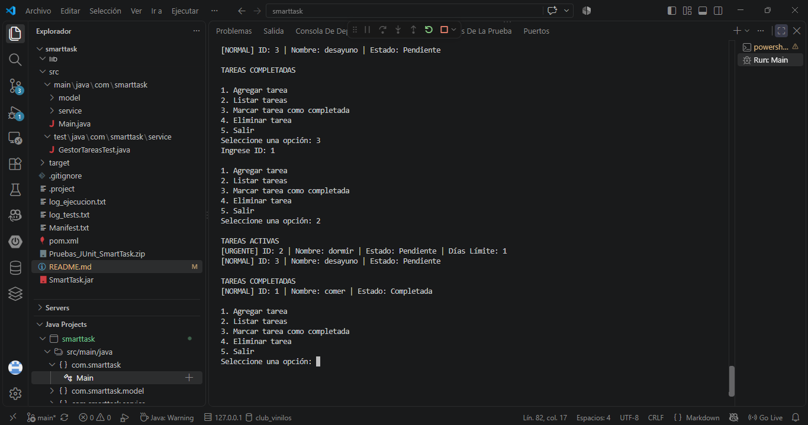
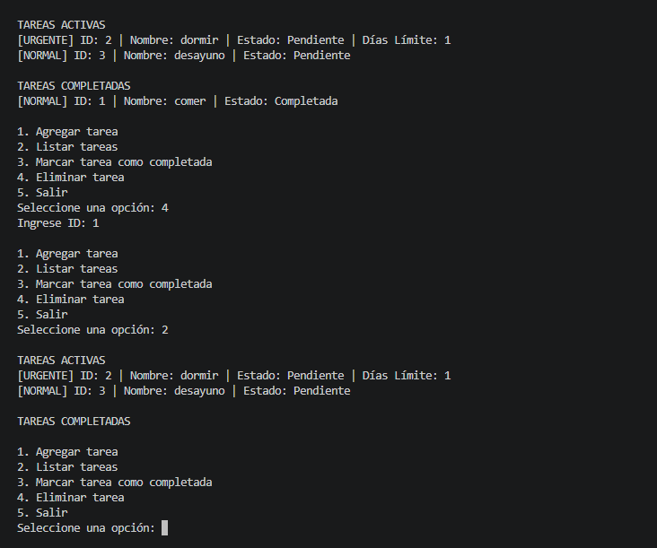

## Descripción
SmartTask es una aplicación de consola desarrollada en Java 25 para administrar tareas personales. Permite registrar tareas de tipo Normal y Urgente, listar tareas clasificadas en activas y completadas, marcar tareas finalizadas y eliminarlas utilizando una asignación automática de IDs autoincrementales controlada de forma centralizada.

## Cómo compilar
Desde la raíz del proyecto, ejecute en la terminal de PowerShell o CMD:

### Opción A: Compilación con Maven
```bash
mvn clean compile

### Opción B: Compilación con Java CLI(Sin Maven)
```bash
javac -encoding UTF-8 -cp "lib/*" -d bin src/main/java/com/smarttask/model/*.java src/main/java/com/smarttask/service/*.java src/main/java/com/smarttask/Main.java src/test/java/com/smarttask/service/*.java

### Cómo ejecutar
Pruebas Unitarias (JUnit 5)
Con Maven:
```bash
mvn test

Con Java CLI:
```bash
java -jar lib/junit-platform-console-standalone-1.10.2.jar --class-path bin --scan-classpath

Aplicación de Consola

Con Maven:
```bash
mvn exec:java -Dexec.mainClass="com.smarttask.Main"

Con Java CLI(Binario o JAR):
```bash
java -cp bin com.smarttask.Main ó java -jar SmartTask.jar

Generación de JavaDoc

### Para generar la documentación HTML del proyecto dentro de la carpeta doc/:

```bash
javadoc -d doc -encoding UTF-8 -charset UTF-8 -docencoding UTF-8 -cp "lib/*" src/main/java/com/smarttask/model/*.java src/main/java/com/smarttask/service/*.java

### Generación del Ejecutable .JAR y Archivo .ZIP Final

### Crear SmartTask.jar:

```bash
"Main-Class: com.smarttask.Main" | Out-File -Encoding ascii Manifest.txt
jar cfm SmartTask.jar Manifest.txt -C bin com

### Crear paquete de entrega comprimido (SmartTask_Entrega_Final.zip):

```bash
Compress-Archive -Path src, pom.xml, log_ejecucion.txt, log_tests.txt, README.md, doc, SmartTask.jar -DestinationPath ..\SmartTask_Entrega_Final.zip -Force

### Estructura de clases

com.smarttask.model

Tarea: Clase abstracta base que encapsula los atributos privados id, nombre y el estado completado.

TareaNormal: Especialización de Tarea que sobrescribe el método toString() agregando el prefijo [NORMAL].

TareaUrgente: Especialización de Tarea que incluye el atributo diasLimite y la regla de negocio estaVencida().

com.smarttask.service

Accionable: Interfaz que define los métodos agregarTarea, listarTareas, eliminarTarea y marcarComoCompletada.

GestorTareas: Clase que implementa Accionable, administra el almacenamiento en memoria (List<Tarea>) y asigna los IDs autoincrementales a partir del 1.

com.smarttask

Main: Clase principal que controla el menú interactivo, la captura de datos con Scanner y la gestión de excepciones de entrada.

### Capturas de Pantalla








### Enlace al repositorio:

Repositorio de GitHub-SmartTask: https://github.com/robertoaedo/smarttask